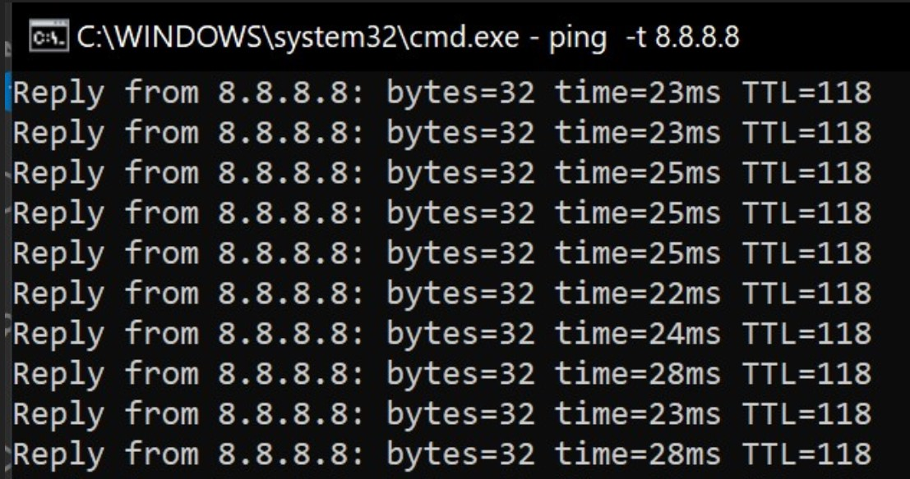
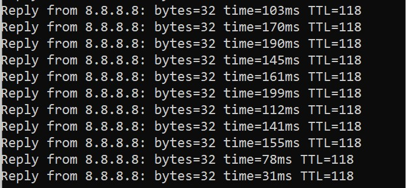

# inet-ping-alert

Background service apps to monitor your network performance and trigger alert if breaching some threshold, built using Golang. The simplest way to determine whether your network performance (e.g. your broadband home network) is by try to pinging publicly available Internet service, which is always available (such as Google DNS 8.8.8.8). In normal condition, your ping latency shall under threshold which is acceptable (in my home network, it's around 20-50ms)



If your network is having problem / intermitten issue, usually the ping latency will be higher, and even timeout



`inet-ping-alert` will continuously monitor this ping latency as indicator whether your Internet connection stable or having some issues. It can trigger some action/alert based on certain alert; in this source code, it will call internal API in my home network, to [turn on I2C LED connected to my raspberry pi](https://github.com/md-ray/i2c-http-server). You can modify to adjust your requirement (e.g. send push notif, change color of your lamp, trigger siren sound, etc.)

This is how I integrate the alert in my use-case


## Important Notice

* This program is made not using clean-code paradigm. This is my first time using golang, and I just want to make things as soon as possible; just getting things done
* Some of parameters are hard-coded. You can directly modify the source code to adjust to your requirement
* This apps only tested in Raspberry Pi (Raspbian OS)

## Prerequisites and Dependencies

* Golang version 1.13. Install golang in Raspberry Pi using [this instructions](https://www.e-tinkers.com/2019/06/better-way-to-install-golang-go-on-raspberry-pi/)
* This app uses several great libraries
  * [Go Resty](github.com/go-resty/resty/v2): to call REST API
  * [Magiconair Properties](github.com/magiconair/properties): to use file-based properties
  * [Go Ping from Sparrc](github.com/sparrc/go-ping): to establish ping connectivity

### Setting-up Cap Net

Go Ping library has some instruction to enable, if we want to run this library in Raspberry Pi.
Please run this command in your Raspberry pi
```
sudo setcap cap_net_raw=+ep /home/pi/go/inet-ping-alert/inet-ping-alert
```

## Configuration

There's a file named PROPERTIES that you can modify. Below are the params that you can adjust
* `host`: The IP address of server that you would like to ping
* `interval`: Period of ping interval, in milisecond
* `timeout`: Timeout value, if ping command response is not received
* `maxlatency`: Maximum latency (in ms) that you would like to use as trigger. If average ping latency goes above this, it will trigger action (e.g. calling HTTP API)

### Configuring the trigger action

You can directly modify the main.go source code, to adjust the action that you would like to do, once the threshold has been breached. In my original source code, it will make a simple HTTP GET API to `http://192.168.x.x/lcd`

## Running

`go run main.go`

## How to make this apps running all the time as service

You can follow this instruction [here](https://slippytrumpet.io/posts/running-your-app-as-service-on-pi-zero-w/).

Here's my init.d service definition in `/etc/systemd/system/inetping.service`

```
## inetping.service

[Unit]
Description=Internet Ping Alert
After=network.target

[Service]
User=pi
WorkingDirectory=/home/pi/go/inet-ping-alert
ExecStart=/home/pi/go/inet-ping-alert/inet-ping-alert
Restart=on-failure
StartLimitIntervalSec=1800

[Install]
WantedBy=multi-user.target
```
